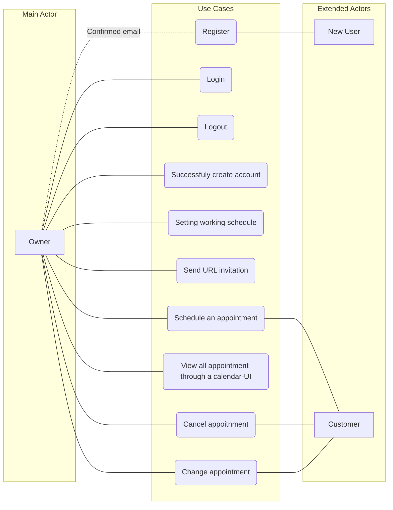

<h1>Product Name</h1>
By: Alex Montgomery (AMontgomery123), Thai Quach (ThaiQ), Sean Milner(Sean), Nguyen Cuu Khanh (khanhsjsu)

**Problem Statement**  
Many people in the professional world need a way to manage appointments. The problem, though, is that many calendar applications do not present a streamlined way to manage them.

**Product Objectives**  
Build an application using Python-3 and the Flask Framework to create an appointment system. This system will allow the customer and owner to communicate with one another by creating meetings through a Calendar-like interface.

**Functional Requirements:**  

-    Database should hold owner login information
    
-   User should not be able to login to an account without providing matching information
    
-   System sends confirmation emails for both registration and appointment confirmation
    
-   Owner can configure what times they are available using Calendar
    
-   Customer can follow email to select desired appointment time with Owner
    
-   Owner can successfully log out of the system

**Non-Functional Requirements:**

-   System must display messages in English
    
-   System will respond to owner and customer commands within 3 seconds
    
-   The site shall be able to run on Windows, Mac, and Linux machines
    
-   System must use Gregorian calendar

# Use Case Description
**UML Diagram**

## Owners’ Use Case Description  
### **Register** 
**Summary:** Allows a user to register for an account 
**Actor(s):** Unregistered user  
**Pre-conditions:**  
1. User must not have an existing account  
2. User must have an existing email address  

**Primary sequence:**  
1.  Click on "Register"  
2.  Input desired login info (email) and password  
3.  Click on “Create Account”  
4.  Confirm email address  

**Alternative sequence:**  
1.  Email does not exist  
* System displays error message “Invalid email address” to the customer

**Post-condition:**
1.  Customer email is successfully confirmed  
    * Customer receives a confirmation email and has accepted it  
    * Customer can now login with their credentials  
1.  Email has not been confirmed
*  Customer can not login because they have not confirmed the email verification
3.  Customer has not successfully created an account  
    *  No account was created presumably due to invalid login info  
---
### **Login**  
**Summary:** Allows a user to log in to their account  
**Actor(s):** Registered-Owner
**Pre-conditions:**  
1.  Registered an account
2.  Confirmed email address of account

**Primary sequence:**  
1.  Enter a username and a password  
2.  (Optional) Select ”Remember Me”  
3.  Click “Login”  

**Alternative sequence:**
1.  If user does not have an account
    *  User inputs an email and password that has not been made  
    *  System displays message to customer saying the account does not exist  
2.  Invalid email
    *  User inputs an email that has not been registered  
    *  System displays message to customer saying the account does not exist  
3.  Invalid password  
    *  User inputs an email matching one in our database, but has an invalid password    
    *  System displays message to customer saying the password was typed incorrectly
4.  User wants to register an account
    *  User selects the “Register” button
    *  System redirects user to the register screen
    
**Post-condition:**
1.  User has successfully logged in
    *  User is redirected to his/her home page by the system.
2.  User has not successfully logged in
    *  User remains on the login page until they provide proper credentials
---
### **Configure active schedule**  
**Summary:** Allows the owner to configure their desired time for customers to make an appointment with
**Actor(s):** Owner 
**Pre-conditions:**  
1.  User must be logged into his/her account

**Primary sequence:**
1.  Click on "Set Working Schedule"
2.  Choose desired Working Time
3.  Click on “Save”
    
**Alternative sequence:**
1.  Click on “Cancel”
    *  System redirects User to home page
    
**Post-condition:**
1.  Working Schedule has been set
    *  System displays a message “Working Schedule set” to User
    *  System redirects Owner to home page
2.  Working Schedule was cancelled
    *  System redirects Owner to home page
    *  Working schedule is the same as it was previously or not set if the Owner has not set it previously
 ---   
### **Send appointment invitation**
**Summary:** Allows the owner to get their unique URL which allows their customer to create an appointment from their selected time.
**Actor(s):** Owner.
**Pre-conditions:**
1.  Users must have an account.
2.  Users must be logged in.
3.  Users have not made an appointment yet.
    
**Primary sequence:** Select "My appointment link" and a unique URL-link is generated for copy.
1.  Users will log into their account.
2.  Users click the “My appointment link” button.
3.  Users must click and copy a unique URL-link.
    
**Alternative sequence:** Select "Send my invitation" which sends an email with the URL-link to the customer's email.
1.  The user must click “Send my invitation”.
2.  If a user does not receive an email with the URL-link
    
**Post-condition:** A URL is available for copy/paste or an email with the URL is sent.

---
## **Customers’ Use Case Description**
### **Make an appointment**  
**Summary:** Allow a customer to make an appointment through the owner's invitation-URL.
**Actor(s):** Customers.
**Pre-conditions:** Must have the invitation-URL from the owner.
1.  The customer receives an invitation email that is sent from users.
    
**Primary sequence:** Click on URL, select valid time from the owner's schedule and save
1.  The customer selects the link URL in the email.
2.  The customer clicks the calendar.
3.  The calendar shows the available date and customers pick their date.
4.  Confirm Reservation
    *  If data were valid: confirmed reservation.
    *  If data were invalid: showed problem in reservation.
    
**Alternative sequence:**
1.  Customer cancels making the appointment
    *  Customer clicks “Cancel”    
    *  System displays message “Appointment was cancelled”
    
2.  Owner is busy at selected time
    *  System displays the message “The person is busy at that time. Please select a new time”
    
3.  Error when connecting to database information
    *  System displays the message “System error communicating to database. Please refresh the page and try again shortly and make sure you have proper internet connection.”
    
**Post-condition:**
1.  Customer has successfully made appointment
    *  Notify the owner and customer about the appointment.
    
2.  Customer cancels making appointment
    *  Notifications not sent to customer and owner

3.  Owner is busy at selected time
    *  Notifications not sent to customer and owner

4.  Error when connecting to database information
    *  Notifications not sent to customer and owner
    
## Glossary:  
**The owner** should be able to: log into their account, configure their working schedule, get/send a URL invitation link to make an appointment with them.  
**The customer** should be able to: make an appointment with the owner through their invitation URL without the need to log in.  
