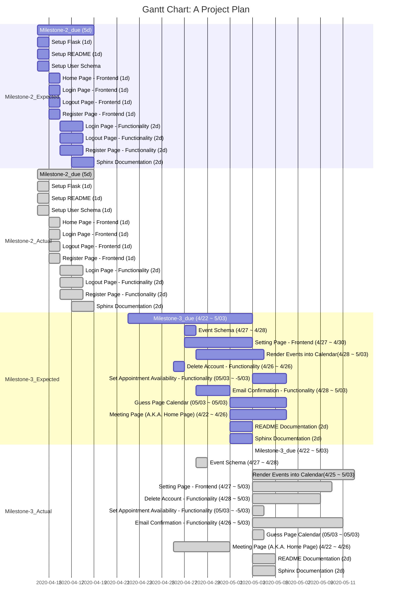

```mermaid
gantt
    title Gantt Chart: A Project Plan

    dateFormat  YYYY-MM-DD

    section Milestone-2_Expected
    Milestone-2_due (5d)                : m1, 2020-04-14, 5d
    Setup Flask (1d)                    : setup, 2020-04-14, 1d
    Setup README (1d)                   : 2020-04-14, 1d

    Setup User Schema : 2020-04-14, 1d
    Home Page - Frontend (1d)           : home, after setup, 1d
    Login Page - Frontend (1d)          : log, after setup, 1d
    Logout Page - Frontend (1d)         : log, after setup, 1d
    Register Page - Frontend (1d)       : register, after setup, 1d

    Login Page - Functionality (2d)     : after log, 2d
    Logout Page - Functionality (2d)    : after log, 2d
    Register Page - Functionality (2d)  : after register, 2d

    Sphinx Documentation (2d)           : 2020-04-17, 2d


    section Milestone-2_Actual
    Milestone-2_due (5d)                : done, 2020-04-14, 5d
    Setup Flask (1d)                    : done, setup, 2020-04-14, 1d
    Setup README (1d)                   : done, 2020-04-14, 1d

    Setup User Schema (1d)              : done, 2020-04-14, 1d
    Home Page - Frontend (1d)           : done, home, after setup, 1d
    Login Page - Frontend (1d)          : done, log, after setup, 1d
    Logout Page - Frontend (1d)         : done, log, after setup, 1d
    Register Page - Frontend (1d)       : done, register, after setup, 1d

    Login Page - Functionality (2d)     : done, after log, 2d
    Logout Page - Functionality (2d)    : done, after log, 2d
    Register Page - Functionality (2d)  : done, after register, 2d

    Sphinx Documentation (2d)           : done, 2020-04-17, 2d


    section Milestone-3_Expected
    Milestone-3_due (4/22 ~ 5/03)                                      : stage1, 2020-04-22, 11d
    Event Schema (4/27 ~ 4/28)                                         : stage1, 2020-04-27, 1d
    Setting Page - Frontend (4/27 ~ 4/30)                              : stage1, 2020-04-27, 6d
    Render Events into Calendar(4/28 ~ 5/03)                           : stage1, 2020-04-28, 6d

    Delete Account - Functionality (4/26 ~ 4/26)                       : stage2, 2020-04-26, 1d
    Set Appointment Availability - Functionality (05/03 ~ -5/03)       : stage2, 2020-05-03, 3d
    Email Confirmation - Functionality (4/28 ~ 5/03)                   : stage2, 2020-04-28, 3d

    Guess Page Calendar (05/03 ~ 05/03)                                : after stage2, 5d
    Meeting Page (A.K.A. Home Page) (4/22 ~ 4/26)                      : after stage2, 5d

    README Documentation (2d)                                          : 2020-05-01, 2d
    Sphinx Documentation (2d)                                          : 2020-05-01, 2d


    section Milestone-3_Actual
    Milestone-3_due (4/22 ~ 5/03)                                       : done, 2020-05-03
    Event Schema (4/27 ~ 4/28)                                          : done, 2020-04-28, 1d
    Render Events into Calendar(4/25 ~ 5/03)                            : done, 2020-05-03, 9d
    Setting Page - Frontend (4/27 ~ 5/03)                               : done, 2020-05-03, 7d

    Delete Account - Functionality (4/28 ~ 5/03)                        : done, 2020-05-03, 6d
    Set Appointment Availability - Functionality (05/03 ~ -5/03)        : done, 2020-05-03, 1d
    Email Confirmation - Functionality (4/26 ~ 5/03)                    : done, 2020-05-03, 8d

    Guess Page Calendar (05/03 ~ 05/03)                                 : done, 2020-05-03, 1d
    Meeting Page (A.K.A. Home Page) (4/22 ~ 4/26)                       : done, 2020-04-26, 5d

    README Documentation (2d)                                           : done, 2020-05-03, 2d
    Sphinx Documentation (2d)                                           : done, 2020-05-03, 2d
```
